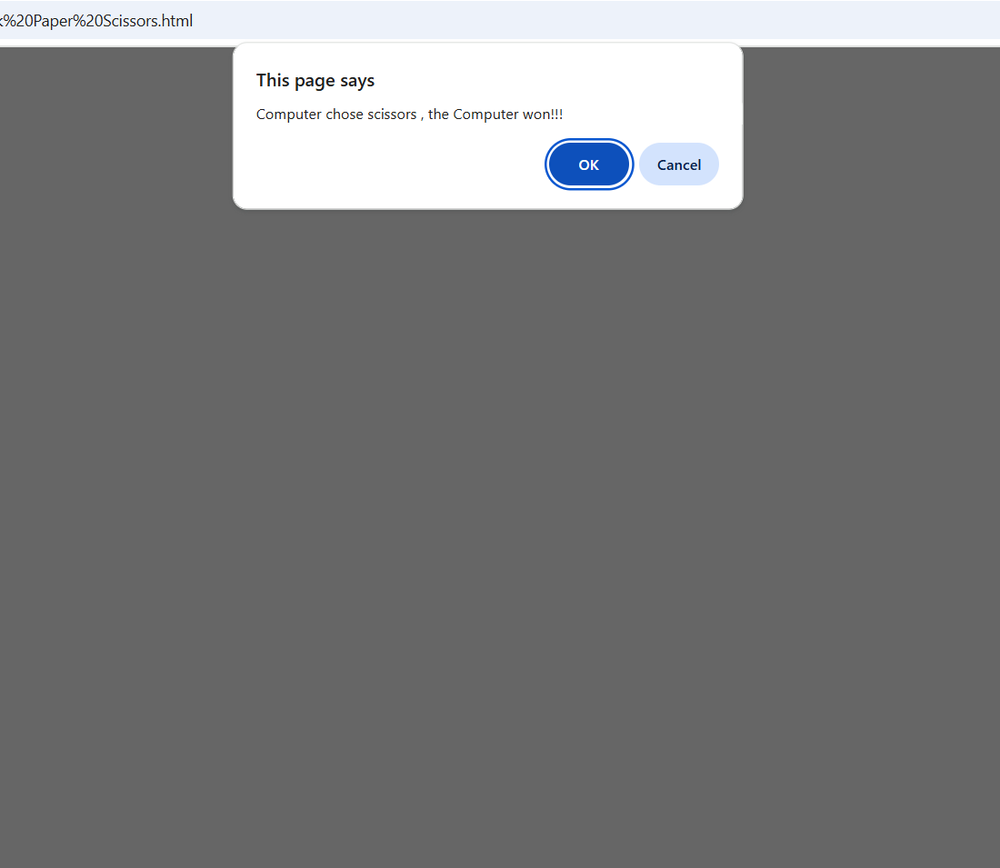

# Rock, Paper, Scissors Game (No Arrays)

This is a simple Rock, Paper, Scissors game implemented in pure JavaScript, designed to run in a browser environment.  
The game runs for 5 rounds and tracks wins for both the user and the computer.  
**No arrays** are used in the code—simple variables and control structures only.

## How the Game Works

- The user is prompted to choose "rock", "paper", or "scissors" each round.
- The computer randomly picks its choice using `Math.random()`.
- If the user enters an invalid choice, they are prompted again until a valid input is received.
- If the round is a tie, both the user and computer must choose again until there is a winner for that round.
- The game tracks the number of rounds each player wins.
- After 5 rounds, the game displays the overall winner using a `confirm` dialog.

## Features

- **Runs for exactly 5 rounds**
- **Handles invalid user input**
- **Handles ties by replaying the round**
- **Tracks and displays scores**
- **No arrays used—just variables and control structures**

## How to Play

1. Open the HTML file in any modern web browser.
2. You will be prompted for your choice each round.
3. Follow the prompts to play all 5 rounds.
4. At the end, see who won the most rounds!

## Code Highlights

- **Random Computer Choice:** Uses `Math.random()` and `if...else` to decide between rock, paper, or scissors.
- **Input Validation:** Ensures only valid choices are accepted.
- **No Arrays:** The code uses only simple variables (no lists or arrays) for all logic and tracking.

## Example

```javascript
let timesOfComputerWin = 0;
let timesOfUserWin = 0;
for (i=1; i<=5; i++){
  // [Game logic as in the script]
}
```
Here’s what the game looks like in the browser:


*Starting a round of Rock, Paper, Scissors*


*Computer wins a round!*


*Final score is displayed after 5 rounds*

## Why No Arrays?

This implementation intentionally avoids using arrays to demonstrate how the game can be built using only basic JavaScript variables and statements.

---

Enjoy playing and learning from the code!
